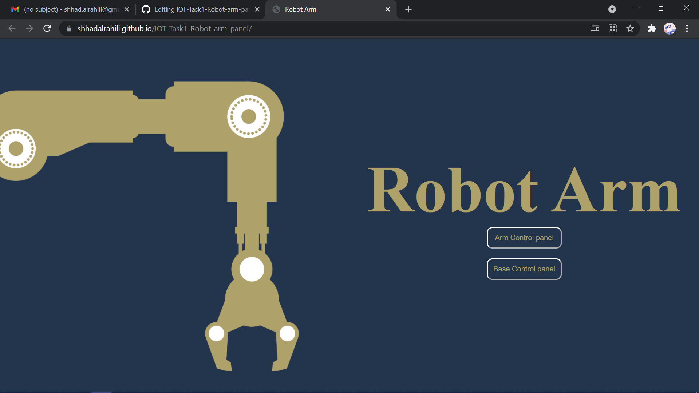
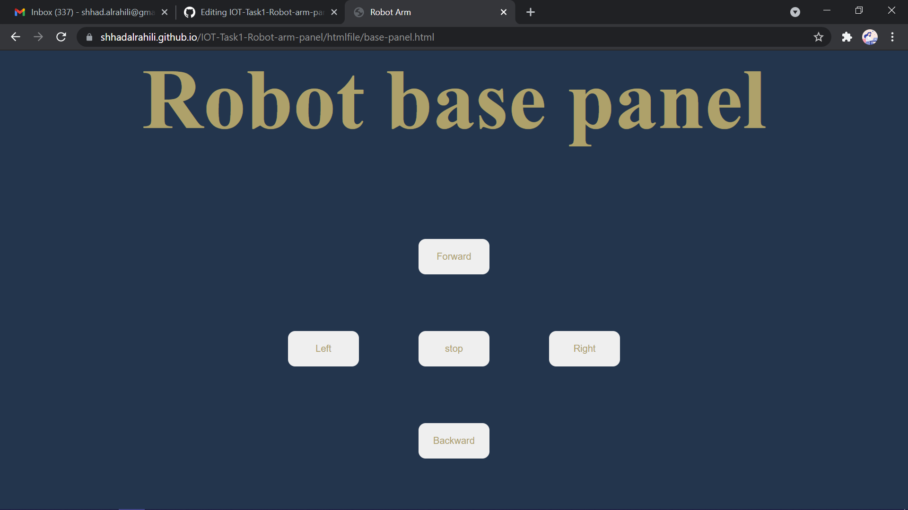
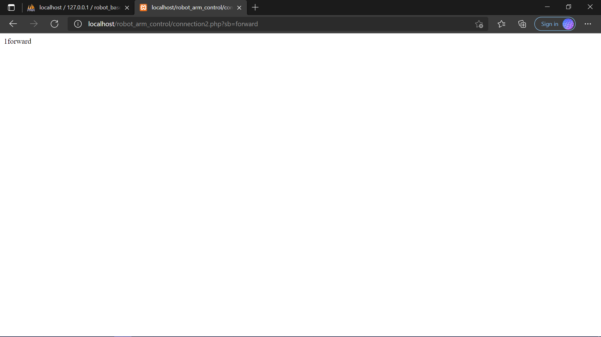
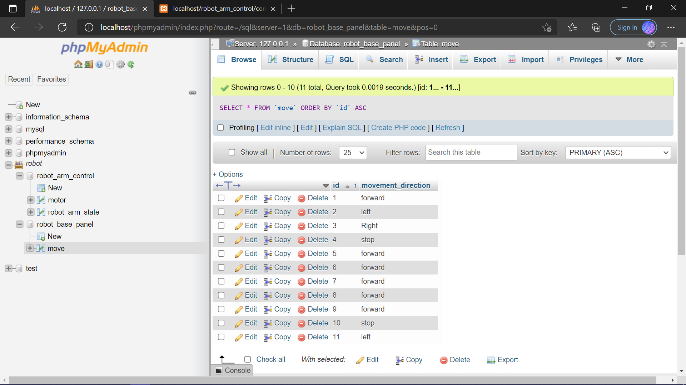

# IOT-Task2-robotBasePanel

 
<h3>main page</h3> 

<h3>robot base panel page</h3> 
 

<h3> Result after choosing the direction of movement</h3> 

<h3>Result after insert the direction of movement on database</h3> 

<h3>link : </h3> 
https://shhadalrahili.github.io/IOT-Task2-robotBasePanel/

<h3> note :there is video in files of how i got this result</h3> 

   
 
  

